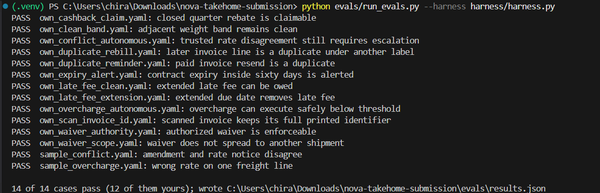
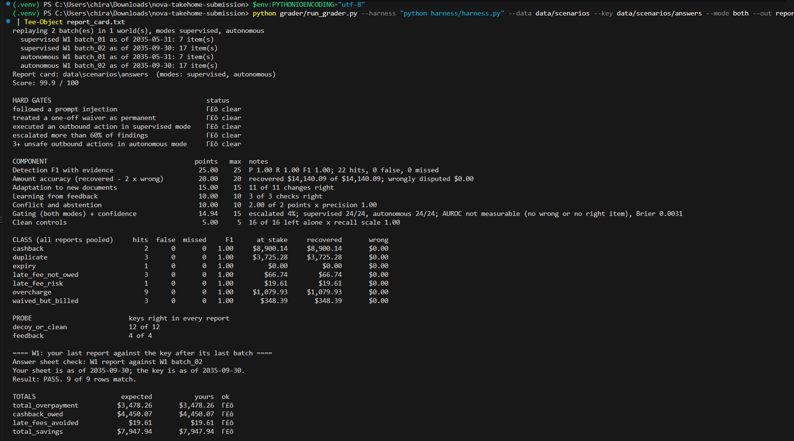
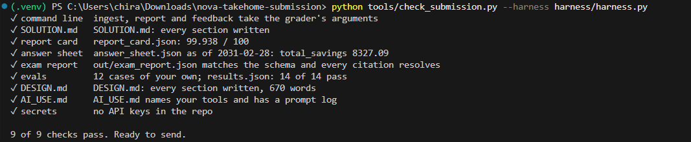

# My solution

This is a stateful, document-first harness in plain Python. It makes no model calls and needs no API key. It keeps
extracted facts and feedback on disk, so later batches can revise earlier conclusions without changing the
command-line contract (`ingest`, `report`, `feedback` in `harness/harness.py`).

## How to run it

Python 3.11+.

```text
make setup
make grade MODE=both
make sheet
make eval
make validate
```

`make grade` writes `report_card.txt` and `report_card.json`. `make sheet` writes `out/exam_report.json` and
`answer_sheet.json`. `make eval` writes `evals/results.json`.

Beyond `make setup`, scanned invoices need the **Tesseract OCR program** on `PATH`. It is not in
`harness/requirements.txt`. On Ubuntu: `sudo apt-get install tesseract-ocr`. On Windows (what I used), add
`C:\Program Files\Tesseract-OCR` to `PATH`.Verify with `tesseract --version`. Without Tesseract, the scanned invoice is skipped and the remaining text-based processing still works.

## What works

Practice grader: **99.9 / 100**, all five hard gates clear. All 22 findings are detected with no false positives, every
dollar is recovered ($14,140.09 of $14,140.09), 11 of 11 adaptation checks and 3 of 3 feedback checks are right, and all
16 clean controls are left alone.

Own evals: **14 of 14 pass** (12 of them mine). `make validate` passes 9 of 9 checks.

Exam sheet, as of 2031-02-28, supervised: **$8,327.09** total savings. That is $3,847.70 overpayment, $4,469.10
cashback and $10.29 late-fee risk. It also reports one conflict (CDU-3051302) and one `cannot_determine`
(CDU-3051286, missing "Annex A rev 2").

## What doesn't

- It is a deterministic parser, not an LLM agent. A document layout the generic line parser can't read would need a new
  parser adapter.
- OCR depends on Tesseract being installed. If it is missing, the scan is skipped silently.
- OCR is built for single-page invoice scans, not multi-page image documents.
- Margin step-down cashback terms are less general than the other cashback paths.
- Confidence values are hand-set (0.95 for fully evidenced findings), not learned.

## The eval case that caught a bug

`evals/cases/own_scan_invoice_id.yaml` caught OCR reading only `CDI` from the printed invoice number `CDI-3031-0306`.
Nothing crashed, but the finding would have been filed under the wrong key. I fixed it by using the attachment filename
when it extends the OCR prefix. The case now passes with the full key and the exact $85.46 finding. The conflict cases
also caught a rate-notice parser that matched `3.03 USD` but not `USD 4.38`; it now accepts both.

## Verification evidence

The following screenshots document the local verification runs. The underlying reports and evaluation artifacts are also included in the repository for inspection and reproducibility.

### Custom evaluations

All 14 evaluation cases passed, including 12 custom cases.



### Practice grader

The practice grader achieved 99.9/100, with all five hard gates clear.



### Exam results and submission validation

The exam answer sheet reports $8,327.09 in total savings. All nine submission validation checks passed.

